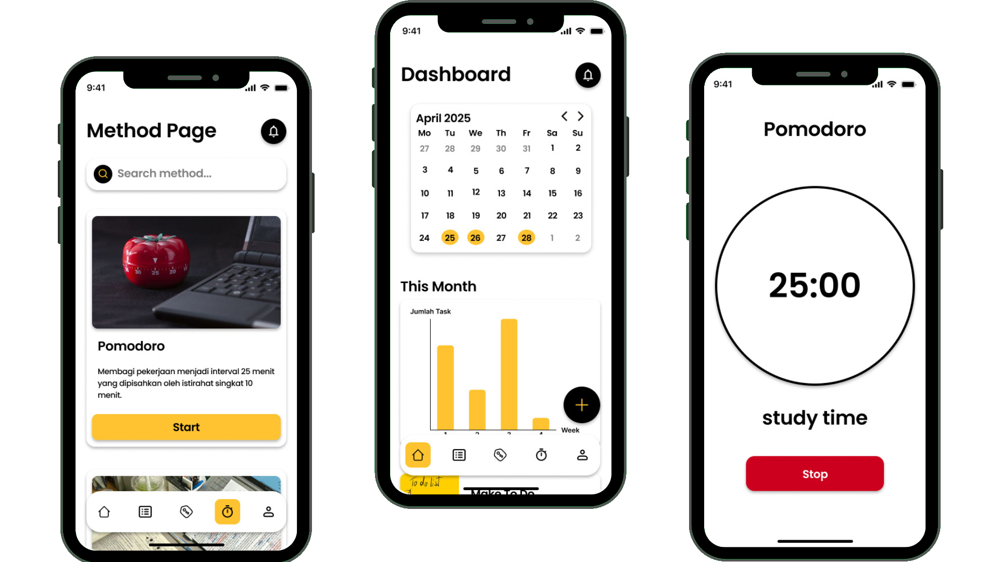

<h1>JAM APP</h1>

<em>Streamline your assignment process, manage your tasks, and maximize your productivity with JAM</em>

<em>Built with the tools and technologies:</em>

 

 

<h2>Table of Contents</h2>
<ul class="list-disc pl-4 my-0">
<li class="my-0"><a href="#ao">App Overview</a></li>
<li class="my-0"><a href="#po">Project Overview</a></li>
<li class="my-0"><a href="#getting-started">Getting Started</a>
<ul class="list-disc pl-4 my-0">
<li class="my-0"><a href="#prerequisites">Prerequisites</a></li>
<li class="my-0"><a href="#installation">Installation</a></li>
<li class="my-0"><a href="#usage">Usage</a></li>
<li class="my-0"><a href="#testing">Testing</a></li>
</ul>
</li>
</ul>

<h2 id="po">App Overview</h2>

Mahasiswa seringkali menghadapi tantangan dalam mengatur waktu mereka secara efisien di tengah padatnya jadwal kuliah, banyaknya tugas, kegiatan kemahasiswaan, maupun hal lainnya yang bersangkutan dengan perkuliahan. Kesulitan dalam manajemen waktu dapat menyebabkan keterlambatan pengumpulan tugas, turunnya kinerja akademik, dan juga menjadi hambatan dalam produktivitas mahasiswa.

Oleh karena itu, JAM hadir sebagai solusi untuk mengatasi masalah-masalah tersebut dengan menyediakan fitur yang interaktif dan cukup membantu mahasiswa untuk perkuliahannya. Fitur solusi yang kami hadirkan yaitu Posting Task, Alarm Finder, To-do List, dan Progress Tracker.

<h2 id="ao">Project Overview</h2>

JAM is a versatile Flutter project designed to facilitate the development of scalable, maintainable cross-platform applications. It integrates a robust MVVM architecture, advanced state management, and offline support to ensure seamless user experiences across devices.

<!-- <ul class="list-disc pl-4 my-0">
<li class="my-0">🧩 <strong>🔧 Puzzle Piece:</strong> Modular MVVM architecture for easy maintenance and scalability.</li>
<li class="my-0">🌐 <strong>🗺 Map:</strong> Seamless navigation with go_router for complex routing scenarios.</li>
<li class="my-0">⚡ <strong>🚀 Rocket:</strong> Offline-first caching to keep apps responsive in unreliable networks.</li>
<li class="my-0">🛡 <strong>🛡 Shield:</strong> Comprehensive error monitoring with Firebase Crashlytics and Sentry.</li>
<li class="my-0">🎨 <strong>🌈 Palette:</strong> Consistent cross-platform UI styling leveraging Flutter's Material Theming.</li>
<li class="my-0">🔄 <strong>🔄 Cycle:</strong> Efficient state management using BLoC and Riverpod for reactive UI updates.</li> -->
</ul>

<h2>Getting Started</h2>
<h3>Prerequisites</h3>

This project requires the following dependencies:

<ul class="list-disc pl-4 my-0">
<li class="my-0"><strong>Programming Language:</strong> Dart</li>
<li class="my-0"><strong>Package Manager:</strong> Pub, Cmake, Gradle</li>
</ul>
<h3>Installation</h3>

Build ALP-Semester-4-JAM- from the source and install dependencies:

<ol>
<li class="my-0">

<strong>Clone the repository:</strong>

<pre><code class="language-sh">❯ git clone https://github.com/Javinpro/ALP-Semester-4-JAM-
</code></pre>
</li>
<li class="my-0">

<strong>Navigate to the project directory:</strong>

<pre><code class="language-sh">❯ cd ALP-Semester-4-JAM-
</code></pre>
</li>
<li class="my-0">

<strong>Install the dependencies:</strong>

</li>
</ol>

<strong>Using <a href="https://dart.dev/">pub</a>:</strong>

<pre><code class="language-sh">❯ pub get
</code></pre>

<strong>Using <a href="https://isocpp.org/">cmake</a>:</strong>

<pre><code class="language-sh">❯ cmake . &amp;&amp; make
</code></pre>

<strong>Using <a href="https://gradle.org/">gradle</a>:</strong>

<pre><code class="language-sh">❯ gradle build
</code></pre>
<h3>Usage</h3>

Run the project with:

<strong>Using <a href="https://dart.dev/">pub</a>:</strong>

<pre><code class="language-sh">dart {entrypoint}
</code></pre>

<strong>Using <a href="https://isocpp.org/">cmake</a>:</strong>

<pre><code class="language-sh">./ALP-Semester-4-JAM-
</code></pre>

<strong>Using <a href="https://gradle.org/">gradle</a>:</strong>

<pre><code class="language-sh">gradle run
</code></pre>
<h3>Testing</h3>

Alp-semester-4-jam- uses the {<strong>test_framework</strong>} test framework. Run the test suite with:

<strong>Using <a href="https://dart.dev/">pub</a>:</strong>

<pre><code class="language-sh">pub run test
</code></pre>

<strong>Using <a href="https://isocpp.org/">cmake</a>:</strong>

<pre><code class="language-sh">ctest
</code></pre>

<strong>Using <a href="https://gradle.org/">gradle</a>:</strong>

<pre><code class="language-sh">gradle test
</code></pre>

<a href="#top">⬆ Return</a>

